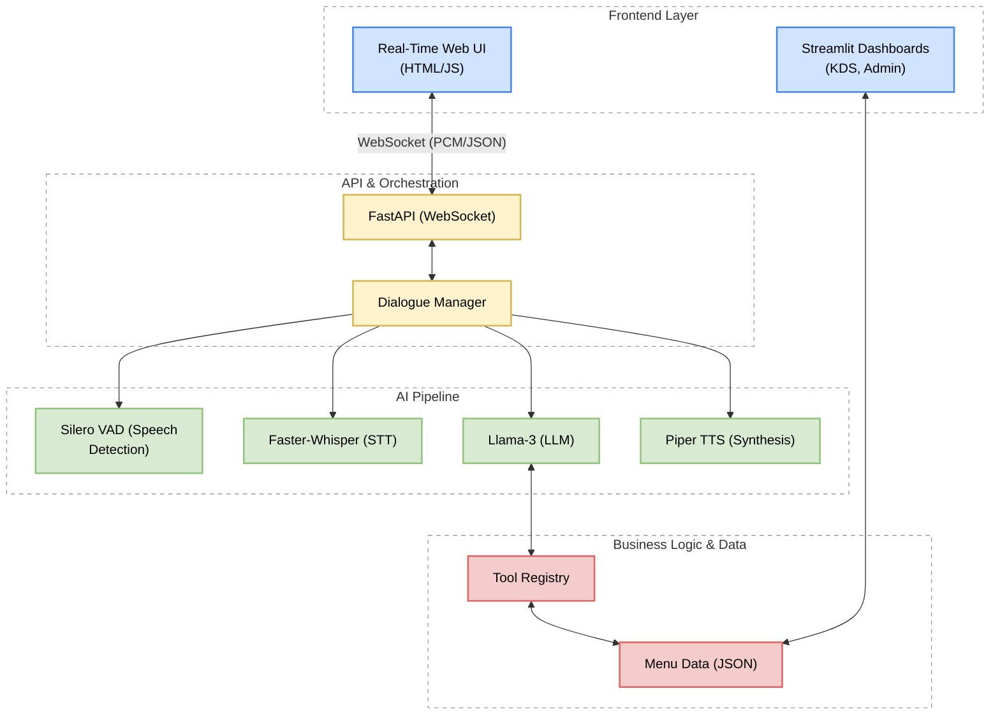

# Drive-Thru Voice Assistant (VA)


An AI-powered, voice-first drive-thru ordering assistant designed for Quick Service Restaurants (QSR). Built using an open-source AI stack (Llama-3, Faster-Whisper, Piper TTS, Silero VAD, FastAPI).

## Features
- **Real-Time Voice Engine (Phase 3)**: High-performance WebSocket server supporting bi-directional streaming of raw PCM audio.
- **Barge-in Support**: Users can interrupt the AI mid-sentence. The system detects speech via VAD and instantly kills the TTS stream.
- **Silero VAD**: Advanced Voice Activity Detection to identify speech boundaries in milliseconds.
- **Voice-Interactive AI**: Real-time voice ordering using Faster-Whisper (STT) and Edge-TTS (Neural Voices).
- **Conversational Memory**: The agent remembers previous turns and maintains order context.
- **Deterministic Business Logic**: LLM tool-calling strictly validated against `order_details.json`.
- **Automatic Checkout**: Smart total calculation including tax, packaging, and order finalization.


## Setup & Installation

1. **Install dependencies:**
   ```bash
   pip install -r requirements.txt
   ```

2. **Set up environment variables:**
   Configure your `LLM_API_KEY` and `LLM_MODEL` in the `.env` file.

## Enabling HTTPS (Required for Real-Time Microphone Access)

To use the real-time voice frontend, modern browsers require a secure HTTPS connection to grant microphone access.

1. **Generate SSL Certificates:**
   Run the following command in the root of the project to generate self-signed certificates:
   ```bash
   openssl req -x509 -newkey rsa:2048 -keyout key.pem -out cert.pem -days 365 -nodes -subj "/CN=localhost"
   ```
2. **Start the secure server:**
   The backend automatically detects `key.pem` and `cert.pem` and will start in HTTPS mode.

## Running the Application

### 1. Start the AI Backend (Real-Time WebSockets)
This handles the real-time audio pipeline, VAD, and Barge-in:
```bash
python -m app.api.main
```
Navigate to `https://localhost:8000` in your browser. (Note: Accept the self-signed certificate warning to proceed).

### 2. Start the Voice Agent Dashboard (Legacy)
The classic Streamlit-based customer interface:
```bash
streamlit run frontend/voice_agent_app.py
```

### 3. Start the Kitchen Display System (KDS)
```bash
streamlit run frontend/kds_app.py
```

### 4. Start the Admin Dashboard
```bash
streamlit run frontend/admin_app.py
```

## Architecture Diagram



## Running Tests
```bash
PYTHONPATH=. pytest tests/
```